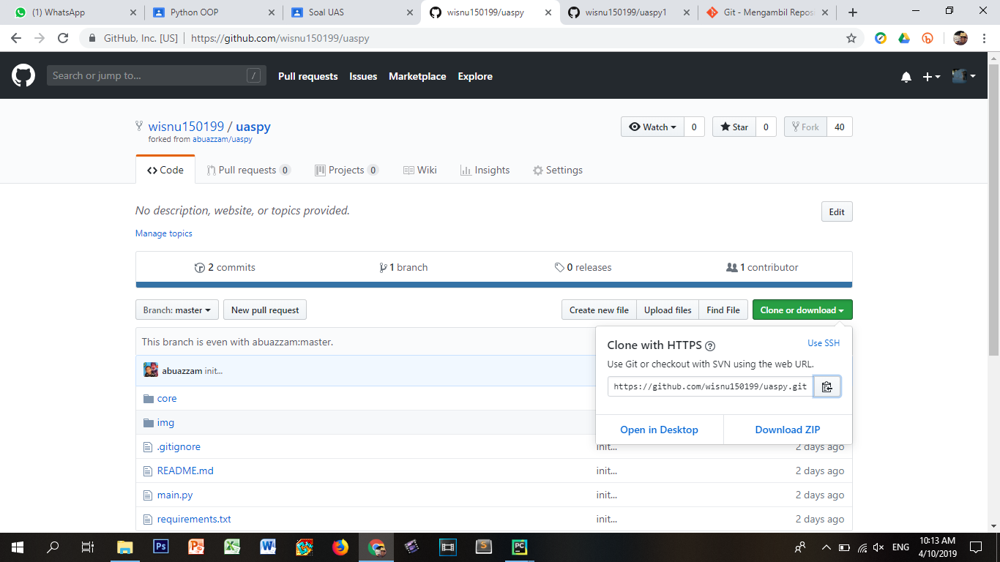
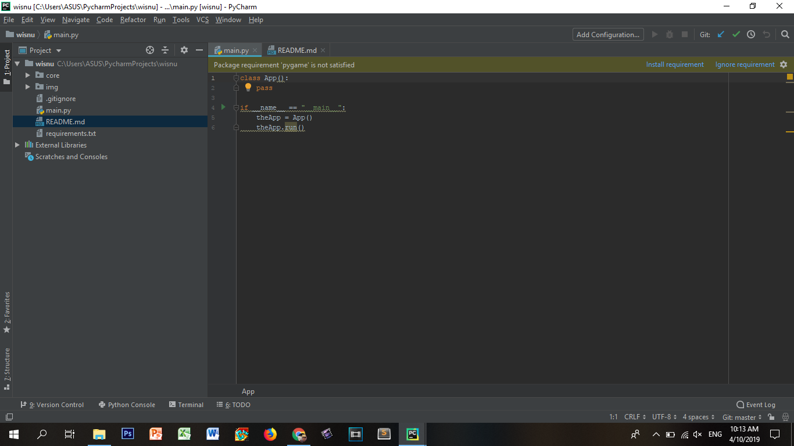
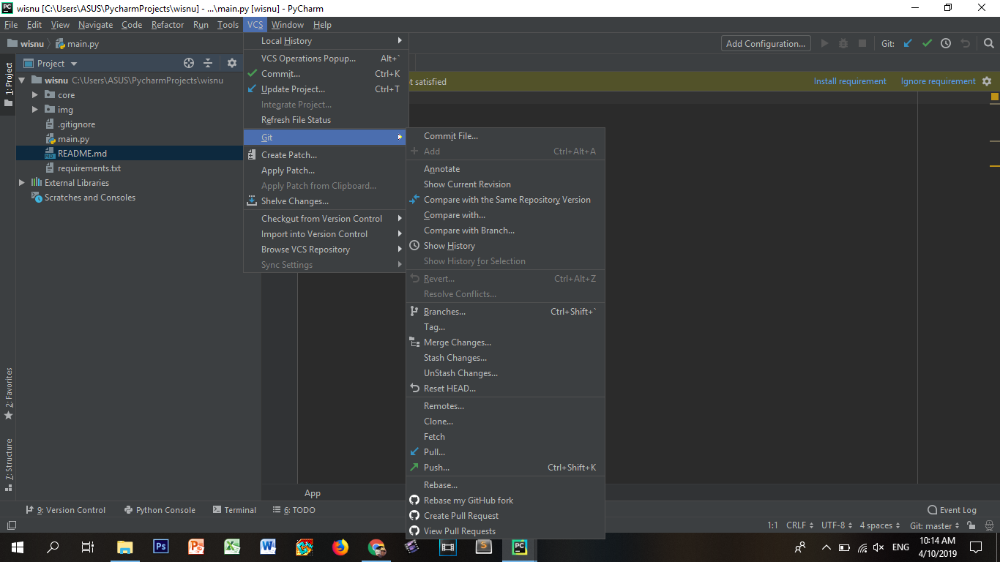
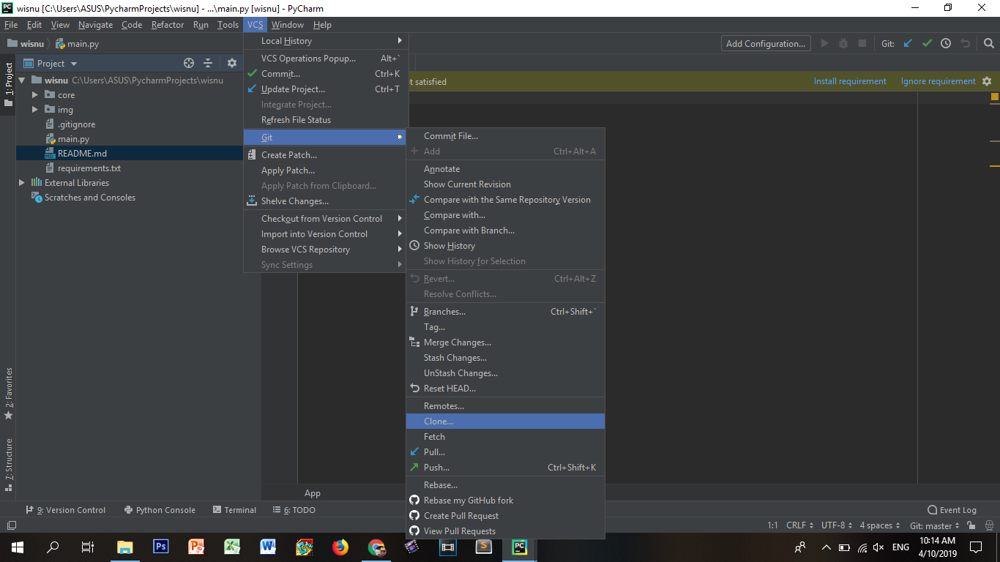
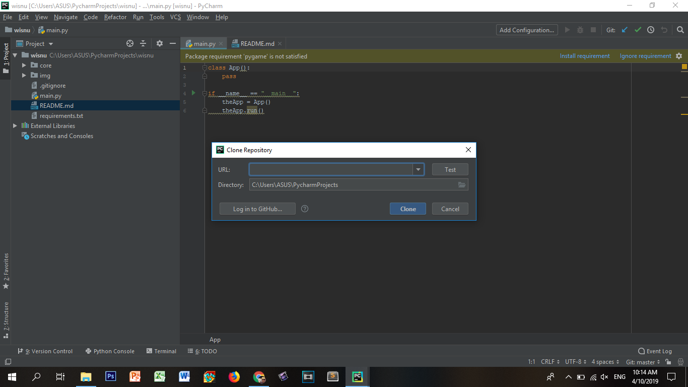

# UAS Bahasa Pemrograman 1

silakan tuliskan langkah-langkah disertai screenshotnya

Pertama klik fork

Kemudian akan muncul di repsitory GitHub wisnu150199/uaspy

selanjutnya salin url ke PyCharm

kemudian buka PyCharm creat environment, setelah creat environment maka tampilannya akan seperti ini.
Selanjutnya klik VCS>>VCS Opreations Popup.

Selanjutnya klik Creat Git Repository

Kemudian buat nama folder

Lalu klik VCS>>Git>>Clone.

Salin URL disini

